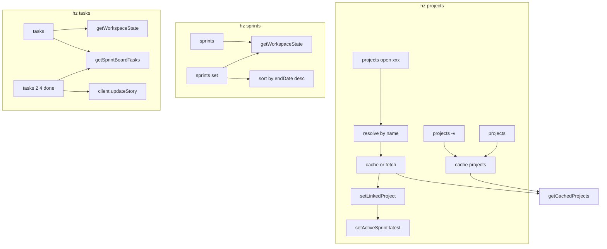

# Dashboard Commands Revamp

## Summary of Changes


| Current                                                    | New                                             |
| ---------------------------------------------------------- | ----------------------------------------------- |
| `hz projects` + `hz projects list`                         | `hz projects` (table) / `hz projects -v` (para) |
| `hz link <index>`                                          | `hz projects open "xxx"` (name-based)           |
| `hz sprints`                                               | `hz sprints` (enhanced: name, status, dates)    |
| `hz sprint <index>` / `hz sprint board` / `hz sprint done` | `hz sprints set` / `hz sprints set -n`          |
| `hz task` / `hz story`                                     | `hz tasks` (unified)                            |


---

## 1. `hz projects`

**File:** [src/modules/projects.ts](src/modules/projects.ts)

### `hz projects` (default)

- Fetch projects via `getProjectsCachedOrFetch(false)` — **always cache after API response**
- Table: project name | sprint count | latest sprint name
- Columns: `#`, `Project`, `Sprints`, `Latest Sprint` (or similar)
- Compute per project: `sprints.length`, latest sprint = sort by `endDate` desc, take first

### `hz projects -v` or `hz projects --verbose`

- Same data source, para-wise output (no table):

```
<project name>
Sprints: total:x, active:y, left:z, paused:a
Latest: <sprint name>
```

- Omit any field that is 0 (e.g. if paused=0, don't show "paused:0")
- **Derived counts:** total = `sprints.length`, active = `status==='Active'`, completed = `status==='Completed'`, left = `status==='Not Started'`, paused = `status==='Paused'`
- Latest sprint: sort by `endDate` desc, first

### `hz projects open "xxx"`

- Resolve project by name (same logic as worklog `hz work active "name"`):
  - Exact match (case-insensitive) on `title` or `uniqueName`
  - Partial match (includes) if single match
  - Multiple matches: error with hint
- Use cached projects if available; else fetch and cache
- Call `setLinkedProject(project.id)`
- Set working sprint: latest active → else latest sprint → else skip
- Call `setActiveSprint(sprint.id)` when sprint exists
- Output: `Linked: <project title>`, `Working sprint: <sprint name>`

### `hz projects open` (no arg)

- Show linked project and working sprint details
- If not linked: "No project linked. Run hz projects open project name."
- If project linked, but no working sprint: "No working sprint. Set using 'hz sprints set'
- Resolve project/sprint from cache or API; display name and sprint name

**Caching:** Update [src/modules/common/index.ts](src/modules/common/index.ts) so `getProjectsCachedOrFetch(false)` always caches after fetch (remove the `active === undefined` guard for caching — cache on every projects fetch).

---

## 2. `hz sprints`

**File:** [src/modules/sprints.ts](src/modules/sprints.ts) — merge sprint.ts sprint-selection logic here; delete [src/modules/sprint.ts](src/modules/sprint.ts)

### `hz sprints` (default)

- List sprints of linked project
- Table: name | status | start date | end date
- Dates: `dd-mm-yyyy` in local timezone (no time)
- Use `project.sprints` from cache; sort by `endDate` desc (latest first)

### `hz sprints set` (no `-n`)

- Set working sprint: latest active → else latest sprint
- If no sprints: show no sprints found
- Output: `Working sprint: <sprint name>`

### `hz sprints set -n` (e.g. `-0`, `-1`, `-2`)

- `-0` = latest sprint (index 0)
- `-1` = second latest, `-2` = third latest, etc.
- If no sprints: show error
- Parse `-n` as non-negative integer; use as index into sprints sorted by `endDate` desc

---

## 3. `hz tasks`

**File:** [src/modules/task.ts](src/modules/task.ts) — merge story.ts logic; delete [src/modules/story.ts](src/modules/story.ts)

### `hz tasks` (default)

- Require linked project + active sprint
- First line: `<sprint name> (<status>)`
- List tasks: `1. <task title>`, `2. <task title>`, etc. (1-based)

### `hz tasks -d` or `hz tasks --details`

- Same header; for each task show title + all stories (title, estimation, status)

### `hz tasks <taskIndex>` (e.g. `hz tasks 2`)

- Show task title + all stories for that task
- Error if task not found

### `hz tasks <taskIndex> <storyIndex>` (e.g. `hz tasks 2 4`)

- Show full story details (priority, assignedTo, description, etc.)
- Error if task or story not found

### `hz tasks <taskIndex> <storyIndex> <status>` (e.g. `hz tasks 2 4 done`)

- Map shorthand to API status: `done`→`Done`, `review`→`InReview`, `todo`→`Todo`, `inprogress`→`InProgress`
- Call `client.updateStory()` with updated status
- Success/error message

### `hz tasks -v` or `hz tasks --view` (interactive)

- Same as `hz tasks` (sprint header + task list)
- Prompt: `Enter task number:` → show stories (title, estimation, status)
- Prompt: `Enter story number:` → show extra details (priority, assignedTo, etc.)
- Use `prompts` package (already in use)

---

## 4. Remove / Replace


| Remove                                         | Reason                                |
| ---------------------------------------------- | ------------------------------------- |
| [src/modules/link.ts](src/modules/link.ts)     | Replaced by `hz projects open "xxx"`  |
| [src/modules/sprint.ts](src/modules/sprint.ts) | Merged into `hz sprints` + `hz tasks` |
| [src/modules/story.ts](src/modules/story.ts)   | Merged into `hz tasks`                |


---

## 5. Index Updates

**File:** [src/index.ts](src/index.ts)

- Remove: `linkCommand`, `sprintCommand`, `storyCommand`
- Keep: `projectsCommand`, `sprintsCommand`, `taskCommand`
- Update help examples to reflect new commands
- Update `projectsCommand` to add `open` subcommand and `-v` option
- Update `sprintsCommand` to add `set` subcommand with `-n` handling
- Update `taskCommand` → `tasksCommand` (rename for consistency) with all options/args

---

## 6. Project Name Resolution (like worklog)

Reuse the pattern from [src/modules/work/active.ts](src/modules/work/active.ts) (lines 34–84):

1. Exact match on `title` or `uniqueName` (case-insensitive)
2. Partial match (includes) — if single match, use it
3. Multiple matches (2–5): error "Type exact name or unique keyword"
4. Many matches (>5): show table of first 5, error with "+N more"

---

## 7. Date Formatting

Use `new Date(isoString).toLocaleDateString('en-GB', { day: '2-digit', month: '2-digit', year: 'numeric' })` for `dd-mm-yyyy` in local timezone.

---

## 8. Sprint Ordering

- "Latest" = most recent by `endDate` descending
- Sort: `sprints.sort((a, b) => new Date(b.endDate).getTime() - new Date(a.endDate).getTime())`
- `-0` = index 0, `-1` = index 1, etc.

---

## 9. Data Flow




---

## 10. Files to Modify/Create


| File                          | Action                                                             |
| ----------------------------- | ------------------------------------------------------------------ |
| `src/modules/projects.ts`     | Rewrite: table/verbose, `open` subcommand, name resolution         |
| `src/modules/sprints.ts`      | Rewrite: table with dates, `set` subcommand with `-n`              |
| `src/modules/task.ts`         | Rename to `tasks.ts` (or keep path), rewrite: all task/story flows |
| `src/modules/common/index.ts` | Cache after every projects fetch                                   |
| `src/index.ts`                | Remove link, sprint, story; wire projects, sprints, tasks          |
| `src/modules/link.ts`         | Delete                                                             |
| `src/modules/sprint.ts`       | Delete                                                             |
| `src/modules/story.ts`        | Delete                                                             |


