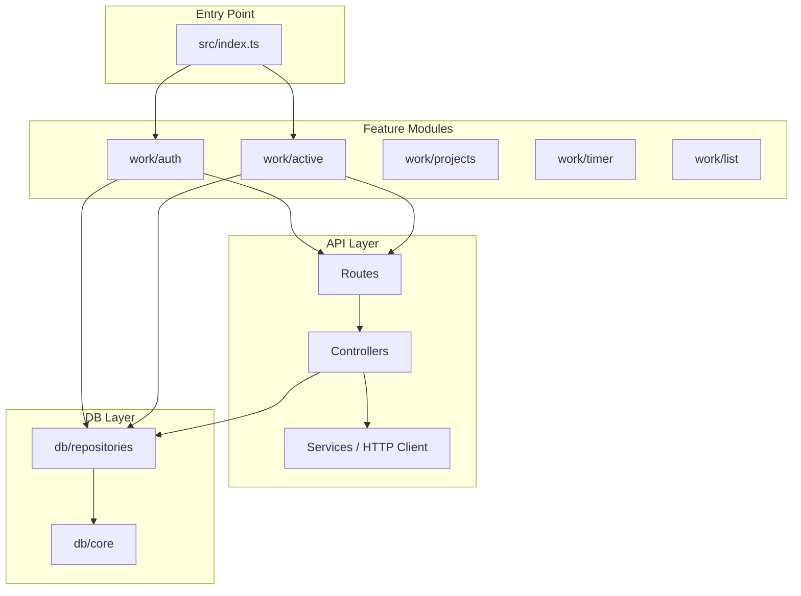

# Heizen CLI Restructure Plan

## Current State

- **API**: `src/api/dashboard.ts` and `src/api/worklog.ts` — monolithic HTTP clients with no separation
- **Commands**: Flat structure in `src/commands/` — `work.ts` (419 lines), `sprint.ts`, `projects.ts`, `tm.ts`, `story.ts`
- **DB**: Single `src/db/index.ts` (245 lines) with all workspace, auth, work, and cache logic
- **Schemas**: Flat `src/schemas/` — `db.ts`, `dashboard.ts`, `worklog.ts`

---

## Part 1: API Layer — Routes, Controllers, Services

### Target Structure

```
src/api/
├── worklog/
│   ├── routes/
│   │   └── index.ts          # Route grouping (auth, worklogs, user)
│   ├── controllers/
│   │   ├── auth.controller.ts
│   │   ├── worklogs.controller.ts
│   │   └── user.controller.ts
│   └── services/
│       └── worklog.client.ts  # HTTP client (axios)
├── dashboard/
│   ├── routes/
│   │   └── index.ts
│   ├── controllers/
│   │   ├── projects.controller.ts
│   │   ├── sprint.controller.ts
│   │   └── story.controller.ts
│   └── services/
│       └── dashboard.client.ts
└── index.ts                   # Re-exports for backward compatibility
```

### Layer Responsibilities


| Layer           | Purpose                                                                                                                     |
| --------------- | --------------------------------------------------------------------------------------------------------------------------- |
| **Services**    | HTTP client only — axios instance, base URL, raw request/response. No validation.                                           |
| **Controllers** | Orchestration — call services, validate with Zod schemas, handle errors, return typed data.                                 |
| **Routes**      | Domain grouping — export controller functions grouped by resource (e.g., `worklog.auth.login()`, `worklog.worklogs.get()`). |


### Migration Steps

1. Extract HTTP logic from [src/api/worklog.ts](src/api/worklog.ts) into `src/api/worklog/services/worklog.client.ts`.
2. Create controllers: `auth.controller.ts` (login), `worklogs.controller.ts` (getWorklogs, addWorklog), `user.controller.ts` (getUserData).
3. Create `worklog/routes/index.ts` that re-exports grouped controller functions.
4. Repeat for dashboard: `dashboard.client.ts`, `projects.controller.ts`, `sprint.controller.ts`, `story.controller.ts`.
5. Add `src/api/index.ts` that re-exports `createWorklogClient`, `worklogLogin`, `createDashboardClient` for backward compatibility.

---

## Part 2: Module-Based Commands, DB, Schemas

### Target Structure

```
src/modules/
├── work/
│   ├── common/         # Shared by 2+ work submodules — requireWorklogAuth, projectDisplayName, formatHours, etc.
│   │   └── index.ts
│   ├── auth/           # hz work login, hz work refresh
│   │   ├── command.ts
│   │   └── db.ts
│   ├── active/         # hz work active
│   │   ├── command.ts
│   │   └── db.ts
│   ├── projects/       # hz work projects
│   │   ├── command.ts
│   │   └── db.ts
│   ├── timer/          # hz work start, hz work done
│   │   ├── command.ts
│   │   └── db.ts
│   ├── list/           # hz work [days] (default)
│   │   └── command.ts
│   └── index.ts
├── sprint/
│   ├── default/        # hz sprint [index]
│   ├── board/          # hz sprint board <sprintId>
│   ├── done/           # hz sprint done <storyId>
│   └── index.ts
├── projects/
│   ├── list/           # hz projects, hz projects list
│   └── index.ts
├── common/              # Cross-module shared (e.g. getProjectsCachedOrFetch for link, sprints, sprint, projects)
│   └── index.ts
├── link/                # hz link — dashboard project only (worklog option removed)
├── sprints/             # hz sprints
├── task/                # hz task
└── story/               # hz story
```

### DB Module Structure

Keep a single `~/.hz/db.json` file. Split `src/db` into:

```
src/db/
├── core.ts             # getDb(), getWorkspaceKey(), DEFAULT_DB
├── schemas/
│   └── db.ts           # DbSchema, WorkSchema, WorkspaceStateSchema, etc.
└── repositories/       # Feature-specific DB accessors
    ├── worklog-auth.ts
    ├── workspace.ts
    ├── pending-works.ts
    ├── projects-cache.ts
    └── ...
```

Each module's `db.ts` imports from `repositories/` and re-exports only what it needs, or modules import directly from repositories.

### Schemas Module Structure

```
src/schemas/
├── db/                 # Local DB schemas
│   ├── work.ts
│   ├── workspace.ts
│   ├── worklog-auth.ts
│   └── index.ts
├── worklog/            # Worklog API schemas
│   └── index.ts
└── dashboard/         # Dashboard API schemas
    └── index.ts
```

### Work Module Submodules (Detail)


| Module            | Commands                 | DB Usage                                                                                                                      | Schemas        |
| ----------------- | ------------------------ | ----------------------------------------------------------------------------------------------------------------------------- | -------------- |
| **work/auth**     | `login`, `refresh`       | `setWorklogAuth`, `clearWorklogAuth`, `getWorklogCookie`, `getWorklogUserData`                                                | WorklogAuth    |
| **work/active**   | `active`                 | `getLinkedWorklogProject`, `setLinkedWorklogProject`                                                                          | WorklogProject |
| **work/projects** | `projects`               | `getRecentWorklogProjects`, `addToRecentWorklogProjects`                                                                      | WorklogProject |
| **work/timer**    | `start`, `done`          | `addPendingWork`, `removePendingWork`, `findPendingWorkByHashPrefix`, `getLinkedWorklogProject`, `addToRecentWorklogProjects` | PendingWork    |
| **work/list**     | default `hz work [days]` | `getPendingWorks`, `getWorklogCookie`, `getWorklogUserData`                                                                   | WorklogEntry   |


### Common Folder Rule

If a method or helper is used by **2+ modules** (or 2+ submodules within a parent), define it in a `common/` folder and import where needed:

- `**modules/work/common/`** — shared by work/auth, work/active, work/projects, work/timer, work/list  
  - Examples: `requireWorklogAuth`, `projectDisplayName`, `formatHours`, `getDateRangeForDay`
- `**modules/common/`** — shared across different top-level modules (link, sprints, sprint, projects)  
  - Example: `getProjectsCachedOrFetch` (used by link, sprints, sprint)

### hz link: Remove Worklog Option

Remove the `-w, --worklog <index>` option and related logic from `hz link`. The command will only link the **dashboard project** to the repo. Users set the worklog project separately via `hz work active "project name"`.

**Current behavior to remove** (from [src/commands/tm.ts](src/commands/tm.ts) lines 40–64): the block that, when `opts.worklog` is set, fetches worklog projects, looks up by index, and calls `setLinkedWorklogProject`.

### Entry Point Changes

Update [src/index.ts](src/index.ts):

- Import `workCommand` from `src/modules/work/index.ts`
- Import `sprintCommand` from `src/modules/sprint/index.ts`
- Import `projectsCommand` from `src/modules/projects/index.ts`
- Import `linkCommand`, `sprintsCommand` from `src/modules/link/` and `src/modules/sprints/`
- Import `taskCommand`, `storyCommand` from `src/modules/task/` and `src/modules/story/`

---

## Data Flow Diagram




---

## Implementation Order

1. **API restructure** — split worklog and dashboard into services, controllers, routes.
2. **DB core** — extract `db/core.ts` and `db/schemas/`, create repositories.
3. **Work module** — create `modules/work/` with auth, active, projects, timer, list submodules.
4. **Sprint, projects, link, sprints, task, story** — migrate to module structure. When migrating link, remove `-w, --worklog` and worklog-linking logic.
5. **Update index.ts** — wire new module imports.
6. **Remove old files** — delete `src/commands/`, old `src/db/index.ts`, consolidate schemas.

---

## Backward Compatibility

- Re-export `createWorklogClient`, `worklogLogin`, `createDashboardClient` from `src/api/index.ts` so existing imports continue to work during migration.
- Use incremental migration: each module can be migrated one at a time.

---

## Files to Create/Modify


| Action | Path                                                                |
| ------ | ------------------------------------------------------------------- |
| Create | `src/api/worklog/services/worklog.client.ts`                        |
| Create | `src/api/worklog/controllers/` (auth, worklogs, user)               |
| Create | `src/api/worklog/routes/index.ts`                                   |
| Create | `src/api/dashboard/services/dashboard.client.ts`                    |
| Create | `src/api/dashboard/controllers/`                                    |
| Create | `src/api/dashboard/routes/index.ts`                                 |
| Create | `src/db/core.ts`, `src/db/repositories/*.ts`                        |
| Create | `src/modules/work/` (common/, auth, active, projects, timer, list)  |
| Create | `src/modules/common/` (getProjectsCachedOrFetch)                    |
| Create | `src/modules/sprint/`, `src/modules/projects/`, link, sprints, etc. |
| Modify | `src/index.ts`                                                      |
| Modify | `hz link` — remove `-w, --worklog` option and worklog linking logic |
| Delete | `src/commands/*.ts` (after migration)                               |


