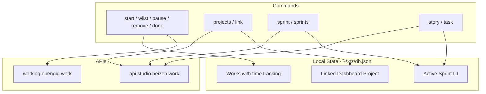

# Hz Task Manager CLI Plan

## Architecture Overview




---

## 1. Data Model and Storage

**Location:** `~/.hz/db.json` (global) + workspace key by `process.cwd()` for repo-specific link/sprint

**Schema:**

```ts
interface Work {
  id: string;           // UUID
  name: string;
  startTime: number;
  pauseTimes: { at: number }[];  // when paused
  resumeTimes: { at: number }[]; // when resumed
  endTime?: number;
  status: 'active' | 'paused' | 'done';
  storyId?: string;     // optional link to dashboard story
}

interface WorkspaceState {
  linkedProjectId?: string;   // dashboard project
  linkedWorklogProjectId?: string;  // for hz done submit
  activeSprintId?: string;
}

interface Db {
  works: Work[];
  workspaces: Record<string, WorkspaceState>;  // key = normalized cwd
  projectsCache?: { fetchedAt: number; projects: Project[] };  // projects with sprints
}
```

**Storage:** `lowdb` with `JSONFilePreset` at `~/.hz/db.json`

**Dependencies:** Add `lowdb`, `prompts` (or `inquirer`)

---

## 2. API Updates

### Dashboard schema ([src/schemas/dashboard.ts](src/schemas/dashboard.ts))

- Add `SprintSchema` (id, name, status, startDate, endDate)
- Add `ProjectWithSprintsSchema` extending project with `sprints: Sprint[]`
- Add `FeatureTaskSchema` (id, title, type, stories)
- Update `SprintBoardResponseSchema` to parse `FeatureTask[]` (array of tasks with stories)

### Dashboard client ([src/api/dashboard.ts](src/api/dashboard.ts))

- `getProjects(active?)` - already exists; ensure response includes sprints (update schema)
- Add `getSprintBoard(sprintId)` - returns `FeatureTask[]`; already exists but verify structure
- `getStory`, `updateStory` - already exist

### Worklog client

- `addWorklog` - already exists; used by `hz done`

---

## 3. New Commands Structure


| Command                                    | Description                                  | Interactive   | API        |
| ------------------------------------------ | -------------------------------------------- | ------------- | ---------- |
| `hz start`                                 | Start work, prompt for name                  | Yes (prompts) | -          |
| `hz wlist [--all]`                         | List ongoing works; `--all` includes done    | No            | -          |
| `hz pause <id>`                            | Pause work by index                          | No            | -          |
| `hz remove <id>`                           | Remove work by index                         | No            | -          |
| `hz done <id>`                             | Complete work, calc hours, submit to worklog | No            | Worklog    |
| `hz projects`                              | List dashboard projects (cached)             | No            | Dashboard  |
| `hz link <index>`                          | Link project to repo                         | No            | -          |
| `hz sprints`                               | List sprints of linked project               | No            | From cache |
| `hz sprint <index>`                        | Set active sprint, show sprint board         | No            | Dashboard  |
| `hz task [index]`                          | List stories in task; prompt if no index     | Optional      | Dashboard  |
| `hz story [taskIndex] [storyIndex] [done]` | Story details or mark done                   | Optional      | Dashboard  |


**Index convention:** 1-based for UX (e.g. `hz pause 3` = 3rd work in list)

---

## 4. Implementation Details

### 4.1 Storage layer

- Create `src/db/index.ts`:
  - `getDb()` - load/create `~/.hz/db.json`
  - `getWorkspaceKey()` - normalize `process.cwd()` for workspace lookup
  - Helpers: `addWork`, `getWorks`, `pauseWork`, `removeWork`, `completeWork`, `getLinkedProject`, `setLinkedProject`, `setActiveSprint`, `cacheProjects`, `getCachedProjects`

### 4.2 `hz start`

- Prompt: `Enter work name:` (prompts library)
- Create work with `status: 'active'`, `startTime: Date.now()`
- Save to db

### 4.3 `hz wlist`

- Read works from db
- Default: filter `status !== 'done'` (ongoing only)
- `--all`: include done tasks
- Display table: index, name, status, duration (computed from start/pause/resume)

### 4.4 `hz pause <id>` / `hz remove <id>`

- Resolve 1-based index to work
- `pause`: push to `pauseTimes`, set `status: 'paused'`
- `remove`: remove from array (only if not done)

### 4.5 `hz done <id>`

- Compute total hours from startTime, pauseTimes, resumeTimes, endTime
- Require `linkedWorklogProjectId` or prompt to select from `hz worklog projects`
- Call `worklog.addWorklog()` with projectId, hours, notes (work name)
- Set work `status: 'done'`, `endTime`

### 4.6 `hz projects`

- Fetch from Dashboard API (or use cache if fresh)
- Cache projects with sprints in db
- Display numbered list

### 4.7 `hz link <index>`

- Set `workspaces[cwd].linkedProjectId` = selected project id
- Optionally prompt for worklog project or add `hz link <index> --worklog <index>` later

### 4.8 `hz sprints`

- Require linked project
- Use cached projects (from `hz projects`), get `project.sprints`
- Display numbered list

### 4.9 `hz sprint <index>`

- Set `activeSprintId` from sprints list
- Fetch sprint board (FeatureTask[]), display tasks with story counts

### 4.10 `hz task [index]`

- Require active sprint
- If no index: prompt `Enter task number:`
- Fetch sprint board, show stories in task at index

### 4.11 `hz story [taskIndex] [storyIndex] [done]`

- If no args: prompt task, then story
- If `done` subcommand: call `dashboard.updateStory` with status Done
- Otherwise: display story details

---

## 5. File Structure

```
src/
├── db/
│   └── index.ts          # lowdb, schema, helpers
├── commands/
│   ├── work.ts           # start, wlist, pause, remove, done
│   ├── projects.ts       # projects, link (refactor existing?)
│   ├── sprint.ts         # sprints, sprint (refactor existing?)
│   └── story.ts          # task, story
├── schemas/
│   └── db.ts             # Work, WorkspaceState, Db
```

**Integration with existing:** The current `projects` and `sprint` commands are under `hz projects list` and `hz sprint board`. We need to either:

- Add new top-level `hz projects` (list + link) and deprecate/merge `hz projects list`
- Or keep `hz projects list` and add `hz link` as separate; `hz projects` could be shorthand for list

**Proposed:** New top-level commands `start`, `wlist`, `pause`, `remove`, `done`, `projects`, `link`, `sprints`, `sprint`, `task`, `story`. The existing `worklog`, `projects list`, `sprint board` stay for direct API access. New commands are the "task manager" workflow.

---

## 6. Dependencies

- `lowdb` - JSON file storage
- `prompts` - interactive prompts (lightweight)
- `uuid` or `crypto.randomUUID()` - work IDs

---

## 7. Order of Implementation

1. Add db layer + schemas
2. Implement `start`, `wlist`, `pause`, `remove` (no API)
3. Update dashboard schemas for projects with sprints, sprint board as FeatureTask[]
4. Implement `projects`, `link`, `sprints`, `sprint`
5. Implement `task`, `story` with prompts
6. Implement `done` (worklog submit)
7. Wire `linkedWorklogProjectId` (prompt or `hz link --worklog`)

