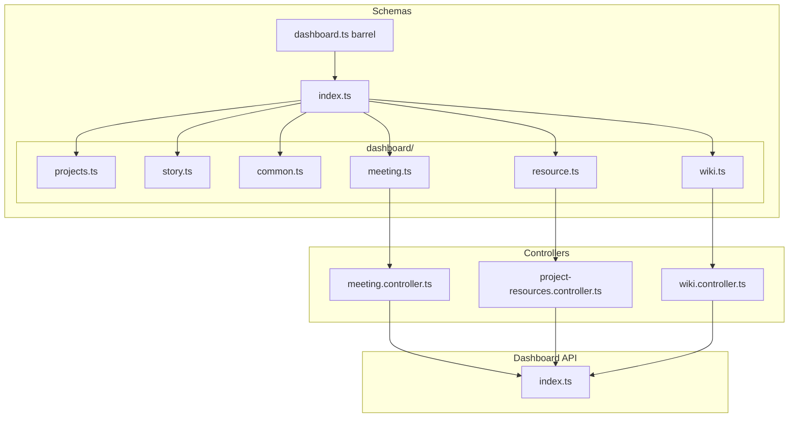

# Meeting, Resources, and Wiki Schemas + APIs

## Context

The codebase uses:

- **Zod schemas** in [src/schemas/dashboard.ts](src/schemas/dashboard.ts) with `Schema` + `type` exports
- **Controllers** in [src/api/dashboard/controllers/](src/api/dashboard/controllers/) that call `client.request(path)` and validate with `safeParse`
- **Dashboard client** in [src/api/dashboard/index.ts](src/api/dashboard/index.ts) that exposes methods via `createDashboardClient(token)`

Base URL is already `https://api.studio.heizen.work` in [client.ts](src/api/dashboard/client.ts).

**Existing consumers** of `schemas/dashboard.js`: projects.controller, sprint.controller, story.controller, modules/common, modules/task, modules/projects. All imports must continue to work via the barrel.

---

## 0. Schema Folder Refactor (Prerequisite)

Split [src/schemas/dashboard.ts](src/schemas/dashboard.ts) into a `dashboard` folder with domain-grouped files. `dashboard.ts` becomes a barrel that re-exports everything so existing imports remain valid.

**Folder structure:**

```
src/schemas/
  dashboard.ts              # Barrel: export * from './dashboard/index.js'
  dashboard/
    index.ts                # Re-exports all domain modules
    projects.ts             # Project, Sprint, ProjectMember, ProjectHealth, etc.
    story.ts                # UserStory, FeatureTask, SprintBoard, refs
    meeting.ts              # MeetingRecord, MeetingCreator, MeetingMetadata
    resource.ts             # ProjectResource
    wiki.ts                 # DocumentNode, ProjectDocument, DocumentCreator
    common.ts               # ApiErrorSchema
```

**Domain file contents:**

| File | Schemas (move from current dashboard.ts) |
|------|------------------------------------------|
| `projects.ts` | ProjectRoleSchema, SprintStatusSchema, HealthStatusSchema, ProjectMemberSchema, ProjectHealthSchema, SprintSchema, DashboardProjectSchema, ProjectsResponseSchema |
| `story.ts` | UserRefSchema, ProjectRefSchema, SprintRefSchema, TaskRefSchema, StoryStatusSchema, UserStorySchema, FeatureTaskSchema, SprintBoardResponseSchema |
| `common.ts` | ApiErrorSchema |
| `meeting.ts` | MeetingCreatorSchema, MeetingMetadataSchema, MeetingRecordSchema (new) |
| `resource.ts` | ProjectResourceSchema (new) |
| `wiki.ts` | DocumentCreatorSchema, DocumentNodeSchema, ProjectDocumentSchema (new) |

**dashboard/index.ts** re-exports:

```ts
export * from './projects.js';
export * from './story.js';
export * from './common.js';
export * from './meeting.js';
export * from './resource.js';
export * from './wiki.js';
```

**dashboard.ts** becomes:

```ts
export * from './dashboard/index.js';
```

**No consumer changes** – all existing imports `from '../schemas/dashboard.js'` or `from '../../../schemas/dashboard.js'` continue to resolve correctly.

**Execution order:** (0) Create folder + domain files, move schemas, add barrel; (1) Add new schemas to meeting/resource/wiki files; (2) Create controllers; (3) Wire into dashboard client.

---

## 1. New Schemas (in meeting.ts, resource.ts, wiki.ts)

**Two Creator variants** (different shapes):


| Schema                  | Use case                      | Fields                                          |
| ----------------------- | ----------------------------- | ----------------------------------------------- |
| `MeetingCreatorSchema`  | MeetingRecord                 | `id`, `first_name`, `last_name`, `avatar_url`   |
| `DocumentCreatorSchema` | DocumentNode, ProjectDocument | `first_name`, `last_name`, `avatar_url` (no id) |


**Schema mapping**:


| Interface       | Zod schema name         | Notes                                                                      |
| --------------- | ----------------------- | -------------------------------------------------------------------------- |
| MeetingMetadata | `MeetingMetadataSchema` | startDate, endDate, durationInSeconds                                      |
| MeetingRecord   | `MeetingRecordSchema`   | Uses MeetingCreatorSchema                                                  |
| ProjectResource | `ProjectResourceSchema` | resourceType, scheduleType as enums with `.or(z.string())` for flexibility |
| DocumentNode    | `DocumentNodeSchema`    | Recursive via `z.lazy()` for `children`                                    |
| ProjectDocument | `ProjectDocumentSchema` | content: `z.record(z.string(), z.any())`, markdown, public_access_level    |


**Snake vs camel case**: Your interfaces use `snake_case` (first_name, avatar_url, created_at). Existing dashboard schemas use camelCase. If the API returns camelCase, we’ll add `.transform()` to map keys. Initial implementation will use snake_case as specified.

---

## 2. New Controllers

Create four controller files mirroring the existing pattern:


| File                              | Function                                 | Path                                    | Returns             |
| --------------------------------- | ---------------------------------------- | --------------------------------------- | ------------------- |
| `meeting.controller.ts`           | `getMeetingRecords(client, projectId)`   | `GET /meeting-data/project/{projectId}` | `MeetingRecord[]`   |
| `project-resources.controller.ts` | `getProjectResources(client, projectId)` | `GET /project-resources/{projectId}`    | `ProjectResource[]` |
| `wiki.controller.ts`              | `getWikiTree(client, projectUniqueName)` | `GET /wiki/project/{projectUniqueName}` | `DocumentNode[]`    |
| `wiki.controller.ts`              | `getWikiDocument(client, documentId)`    | `GET /wiki/{documentId}`                | `ProjectDocument`   |


Pattern from [projects.controller.ts](src/api/dashboard/controllers/projects.controller.ts):

```ts
const raw = await client.request<unknown>(`/path/${param}`);
const parsed = Schema.safeParse(raw);
if (!parsed.success) { /* log + throw */ }
return parsed.data;
```

---

## 3. Wire into Dashboard Client

In [src/api/dashboard/index.ts](src/api/dashboard/index.ts):

- Import the four new controller functions
- Add to `createDashboardClient()` return object:
  - `getMeetingRecords: (projectId: string) => ...`
  - `getProjectResources: (projectId: string) => ...`
  - `getWikiTree: (projectUniqueName: string) => ...`
  - `getWikiDocument: (documentId: string) => ...`

---

## 4. File Summary




---

## 5. Implementation Notes

- **DocumentNode recursion**: Use `z.lazy(() => DocumentNodeSchema)` for `children` to support recursive trees.
- **ProjectResource enums**: `resourceType` and `scheduleType` use `z.enum([...]).or(z.string())` for forward compatibility.
- **Public access level**: `z.enum(['View', 'Edit']).or(z.string())`.
- **Response arrays**: Use `z.array(MeetingRecordSchema)`, etc., for array endpoints.

